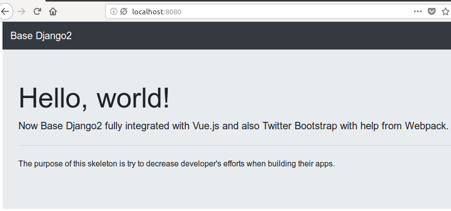

# Base Django
Base configuration and structure (or skeleton) when working with Django Web Framework.  Now,
i'm just using Django 2.x version.

The purpose of this skeleton is to reduce developer's efforts when they try to create an app,
we should not create and setup from scratch.

I try to setup all common activities like :

- Logging
- Environment variables
- Integration with Webpack
- Integration with Vue.js
- Integration with Twitter Bootstrap
- Integration with Django Debug Toolbar
- Integration with Mailgun as `EmailBackend`
- Faker
- Fabric

---

## Python Version

Recommended: `>= 3.6.x`

---

## Django Version

Recommended: `>= 2.x.x`

---

## Environment Variable

Please copy and rename `env.sample` to `.env` and update all values based
on your needs.

---

## Vue.js Integration

By default, this skeleton integrated with Vue.js.  I'm using `django-webpack-loader`
to manage all webpack things.  If you want to integrate with Angular or React, just
modify `webpack.config.js`.

**Usages** :

- Make sure you have `node.js` installed on your computer (i'm suggest using `nvm`)
- go to `project/` folder ( `cd project` )
- Using: `npm install` to install all dependencies
- Using: `npm run build` to build all of your js codes

**Notes** :

- All of npm and node things, inside `project/`
- You are allowed to modify `package.json` and `webpack.config.js` to fill your needs
- I just put all of js codes, inside `project/assets/js/vue/`

**Refs** :

- https://github.com/ezhome/django-webpack-loader

---

## Twitter Bootstrap Integration

Now, this skeleton integrated with `Twitter Bootstrap` (4.x.x) too.  To install bootstrap,
you just need to run :

```
npm install
```

then:

```
npm run build
```

or using fabric:

```
fab npm.install npm.build
```

This build process will produce `style.css` at `project/assets/bundles`, you can change this
name from `webpack.config.js`.

How to load ? You can see the example at `welcome/templates/welcome/index.html`.

---

## Webpack

By default all webpack's activities will run on `production` mode, you can modify this configuration at `package.json`
and change it with `development` or maybe add new script separate between production and development.

**Code Splitting**

There is a technique called _code splitting_ from Webpack.  I'm using this technique too, to split
between our main js app with vendors (like twitter bootstrap), and also using `ExtractTextPlugin`
to extract css codes to separated files.

---

## Fabric And NPM Command Lines

There is something you need to know about `Fabric` and `Npm`.

- When you want to use fabric tasks, you need to go to root of your project.
- When you want to use npm commands, you need to go to `project/` folder and execute npm command
inside that folder.

---

## Memberships

I just added new functionalities for membership activities, they are :

- Register
- Login

These codes available at `project/memberships` .  You can learn how to manage your application's
module from this app.

---

## Email Using Mailgun

There are two additional configurations :

- MAILGUN_API_KEY
- MAILGUN_DOMAIN

You can get these configurations from your Mailgun's account dashboard.  Get all values
and set in `.env` file.

When you need to send an email you can use this code:

```python
from django.core import mail

conn = mail.get_connection() # Will return custom mail backend instance
mailer = mail.EmailMessage(
    'test subject',
    'test message',
    'testfrom@shell.com',
    ['to@mail.com'],
    connection=conn
)

mailer.send()
```

To send html:

```python
from django.core import mail

conn = mail.get_connection(as_html=True) # Will return custom mail backend instance
mailer = mail.EmailMessage(
    'test subject',
    '<p>test message</p>',
    'testfrom@shell.com',
    ['to@mail.com'],
    connection=conn
)

mailer.send()
```

Or, more simpler way:

```python
from django.core import mail

# will send as text plain
mail.send_mail(
    'test subject',
    'test message',
    'testfrom@shell.com',
    ['to@mail.com']
)

# will send as html
conn = mail.get_connection(as_html=True) # Will return custom mail backend instance

mail.send_mail(
    'test subject',
    '<p>my message</p>',
    'testfrom@shell.com',
    ['to@mail.com'],
    connection=conn
)
```

Ref: [https://docs.djangoproject.com/en/2.0/topics/email/](https://docs.djangoproject.com/en/2.0/topics/email/)
